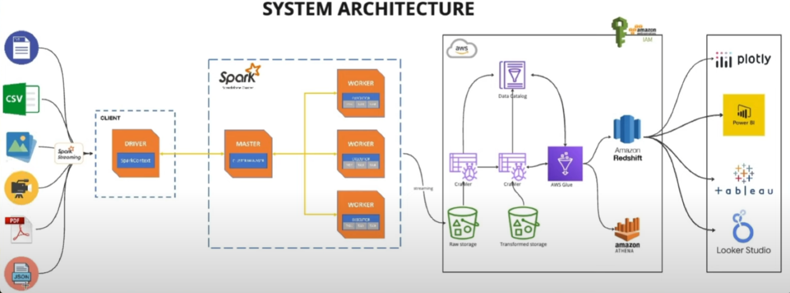

# Architecture diagram



# local pyspark running

```
spark-submit --packages org.apache.hadoop:hadoop-aws:3.3.1,com.amazonaws:aws-java-sdk:1.11.469,com.fasterxml.jackson.core:jackson-databind:2.15.3 ./main.py 
```

# Docker commands

### Run dicker compose

```
docker compose up -d
```

### Verify topic list in a specific port

```
kafka-topics --list --bootstrap-server broker:29092
```

### Delete topic by an specific port

```
kafka-topics --delete --topic emergency_data --bootstrap-server broker:29092
```

### Run script into workers

```
docker exec  -it aws_spark_unstructured spark-submit --master spark://spark-master:7077 --packages org.apache.hadoop:hadoop-aws:3.3.1,com.amazonaws:aws-java-sdk:1.11.429 jobs/main.py
```


References: 
- [Unstructured data processing](https://www.youtube.com/watch?v=M6BWTnMH77M)