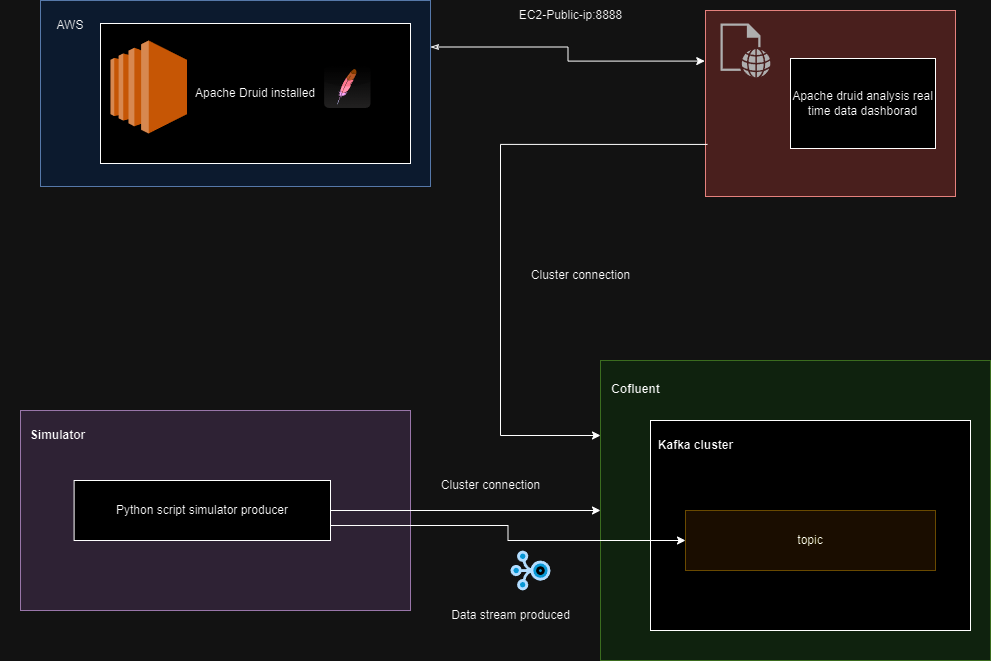
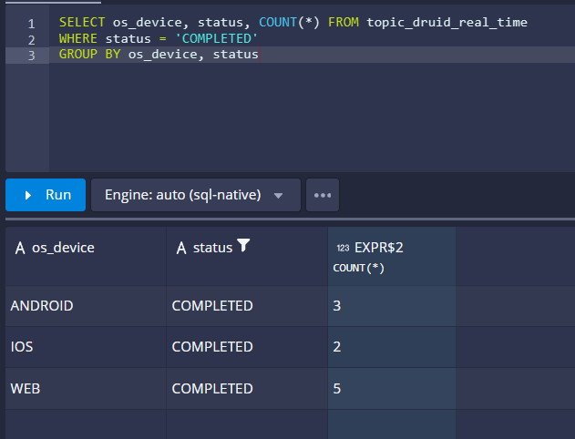
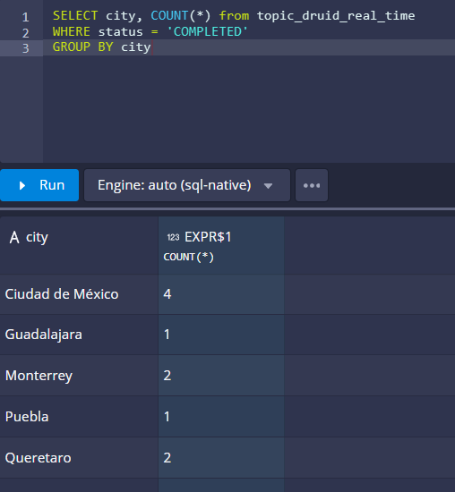
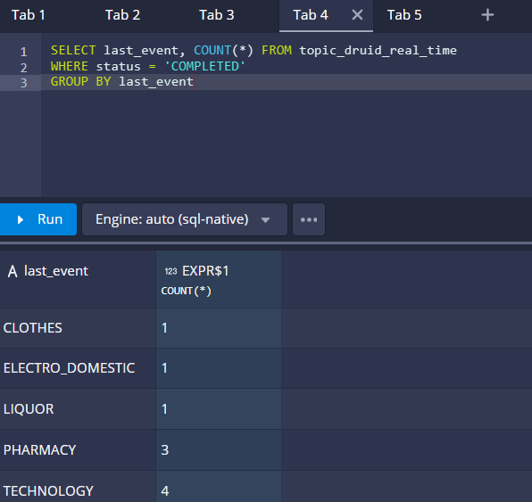
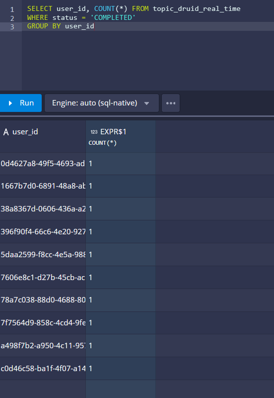

# Diagram

# Practices description 
This project simulate user purchases in multiple categories in real time and uses kafka for analysis

# AWS Ec2 instance 

[Installation and configurations](https://datexland.medium.com/how-to-deploy-apache-druid-on-aws-ec2-instance-50af955edef)

# Simulator script and where the data comes from - `e-commerce-kafka-user-interaction-app-simulation`

# Questions to answer on kafka dashboard analysis

1. What is the OS device which more purchases in COMPLETED
- 
2. What’s the city which more purchases in COMPLETED
- 
3. What’s the e-commerce category which more purchases in COMPLETED
- 
4. How many users made a more than two purchases
