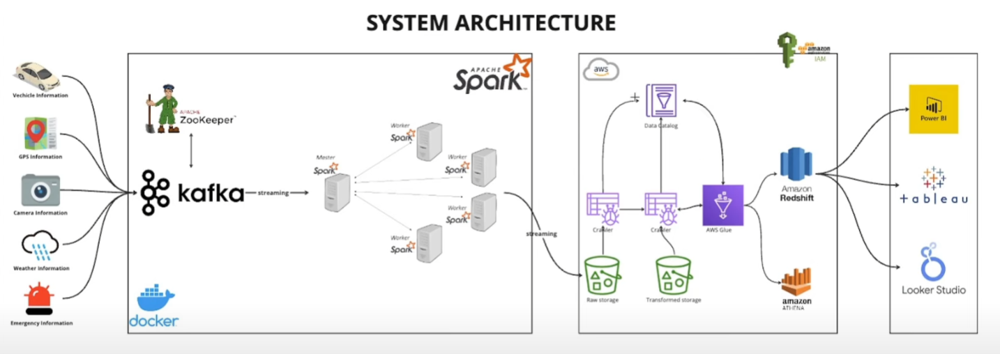

# Architecture diagram



# Docker commands

### Verify topic list in a specific port

```
kafka-topics --list --bootstrap-server broker:29092
```

### Delete topic by an specific port

```
kafka-topics --delete --topic emergency_data --bootstrap-server broker:29092
```

### Run workers job

```
docker exec  -it smart-city-spark-master-1 spark-submit --master spark://spark-master:7077 --packages org.apache.spark:spark-sql-kafka-0-10_2.12:3.5.0,org.apache.hadoop:hadoop-aws:3.3.1,com.amazonaws:aws-java-sdk:1.11.429 jobs/spark-city.py
```


References: 
(Smart city kafka streaming)[https://www.youtube.com/watch?v=Vv_fvwF41_0]