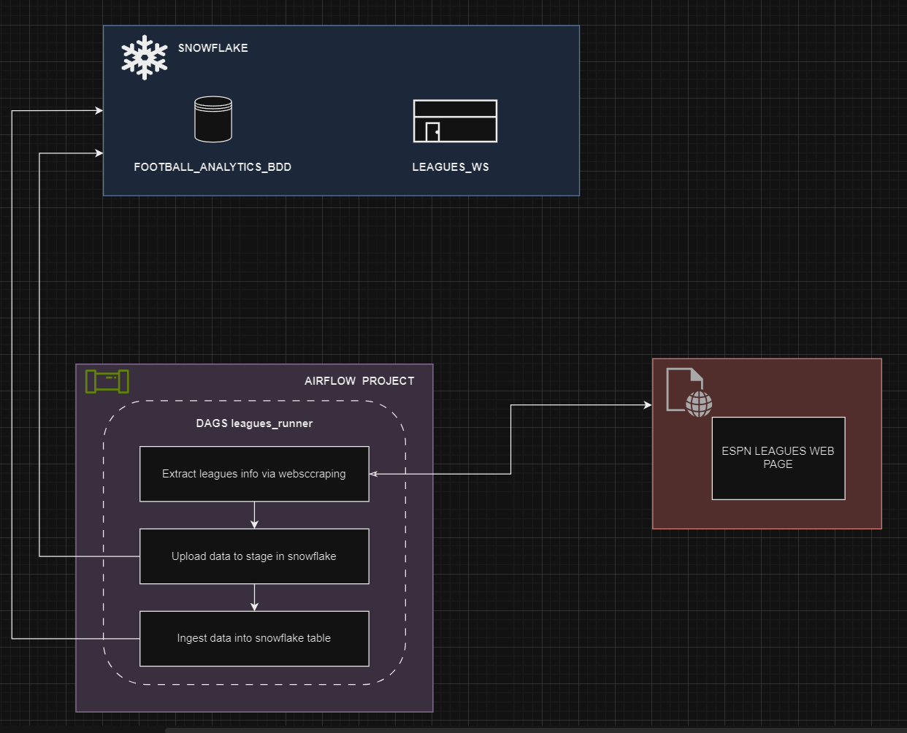
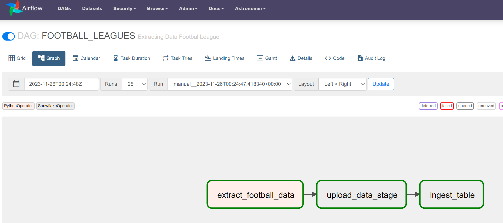
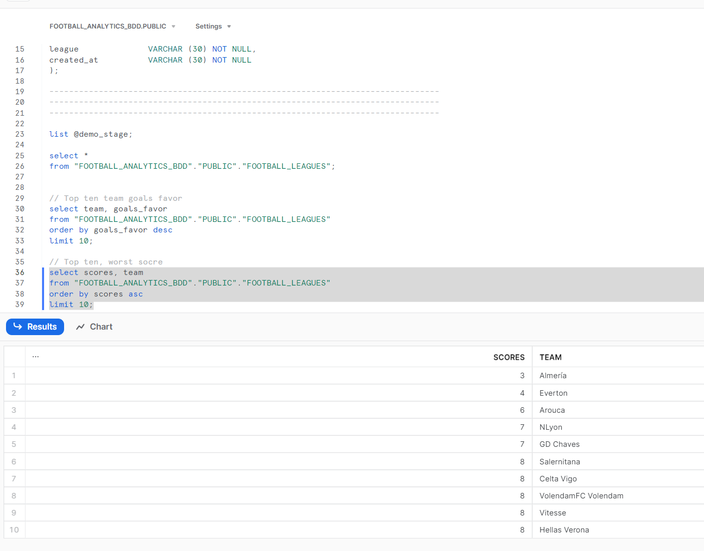

### Practice:

- Create a pipeline in Airflow that extracts the current football leagues information via python web scraping from  and connect to Snowflake so that ingest the result data into a database and WH.

### References:

- [Snowflake](https://www.mparticle.com/blog/how-does-snowflake-work/)
Is a cloud data warehouse that can store and analyze all your data records in one place. It can automatically scale up/down its compute resources to load, integrate, and analyze data.

- [Airflow](https://airflow.apache.org/docs/apache-airflow/stable/index.html#why-airflow)
An open-source platform for developing, scheduling, and monitoring batch-oriented workflows. Airflow’s extensible Python framework enables you to build workflows connecting with virtually any technology. A web interface helps manage the state of your workflows.

- [Astronomer](https://docs.astronomer.io/astro)
Astro is a cloud solution that helps you focus on your data pipelines and spend less time managing Apache Airflow, with capabilities enabling you to build, run, and observe data all in one place.

### Run locally

1. Run project
```sh
astro dev start
```

2. Stop server
```sh
astro dev stop
```
### Find port and kill process if postgres port is in used
```sh
netstat -aon | findstr :5432
taskkill/pid <el pid de la task> /F
```

### Env variables

```sh
	{
        "path_file":"/usr/local/airflow/premier_positions.csv",
        "stage":"DEMO_STAGE",
        "table":"FOOTBALL_LEAGUES",
        "DWH":"LEAGUES_WS",
        "DB":"FOOTBALL_ANALYTICS_BDD",
        "ROLE":"ACCOUNTADMIN"
    }
```

### Architecture diagram



### Results

- Pipeline in airflow



- Snowflake tables
