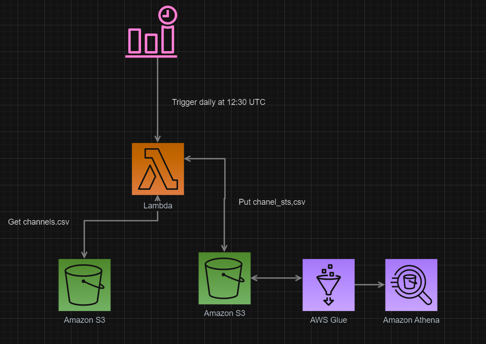

### Practice:

- Create an AWS lambda that runs a python script which retrieves the statistics of
 some youtube channels, stores the result into an S3 bucket and triggers Athena analytics.

 ### Resources
- Cloud stack was created via CDK
 [CDK](https://cdkworkshop.com/30-python/20-create-project/100-cdk-init.html)
 [CDK example](https://cloudbytes.dev/snippets/aws-cdk-building-a-eventbridge-scheduled-lambda-that-reads-and-writes-to-s3)

 ### Architecture diagram

 