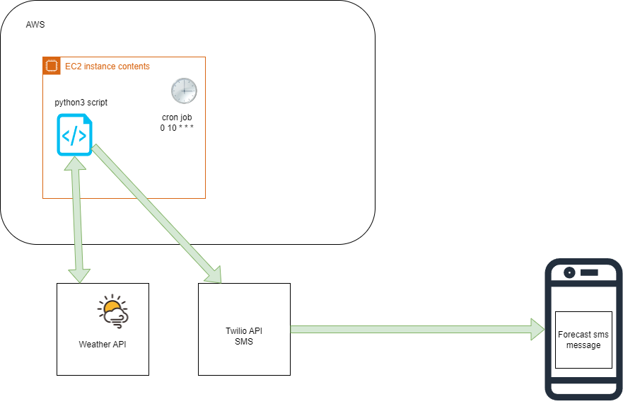
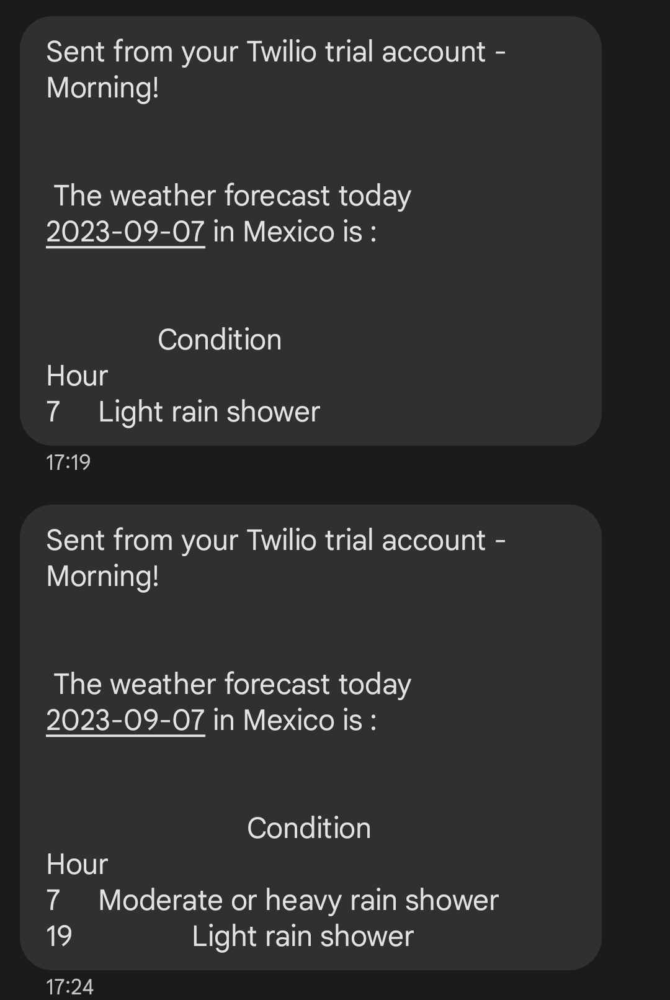

Practice:

- Deploy a python script into an aws EC2 instance that comsumes a weather api in order to send messages
  to a particular user via SMS with the forecast information.

API Resources:

- [Twilio](https://console.twilio.com/us1/develop/phone-numbers/manage/incoming)

- [API weather](https://www.weatherapi.com/api-explorer.aspx)

steps:

1. Create an EC2 instance t2.micro within free tier account under Ubuntu

2. Connect with EC2 instance VIA SSH Client:

`sudo ssh -i "key_pair_file_example.pem" ubuntu@ec2-54-69-100-240.us-west-2.compute.amazonaws.com`

3. `sudo apt update && sudo upgrade`

4. `sudo apt install -y python3-pip`

5. clone/ copy or upload the following files into the ec2

- utils.py
- twilio_script.py
- twilio_config.py (twilio_config_example.py)
- requirements.txt

6. `pip3 install -r requirements.txt`

7. Type `crontab -e` for creating the cronjob everyday at 17:10:00 UTC

8. Type the cron job script into the file

`10 17 * * * /usr/bin/python3 twilio_script.py >> script.log 2>&1`

9. Save file and wait for messages

